

  
    

    A cross-platform multiplayer RPG game experience for desktop and mobile
    

  

# 📔 Table of Contents

-   [About the Project](#star2-about-the-project)
    -   [Screenshots](#camera-screenshots)
    -   [Tech Stack](#space_invader-tech-stack)

## 🌟 About the Project

### 📷 Screenshots

    
Register & login

  
    
Main Menu

  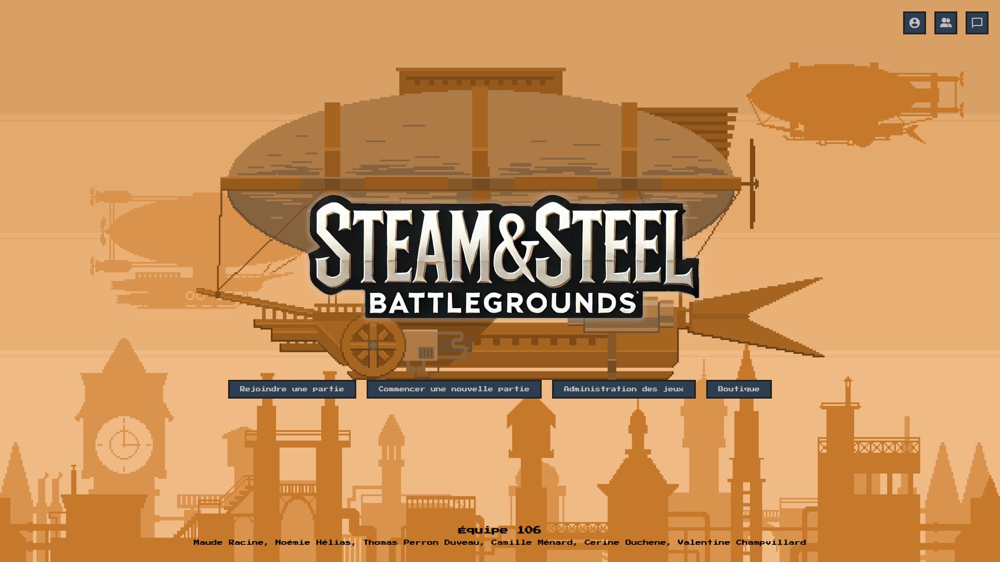
      
Account Screen

  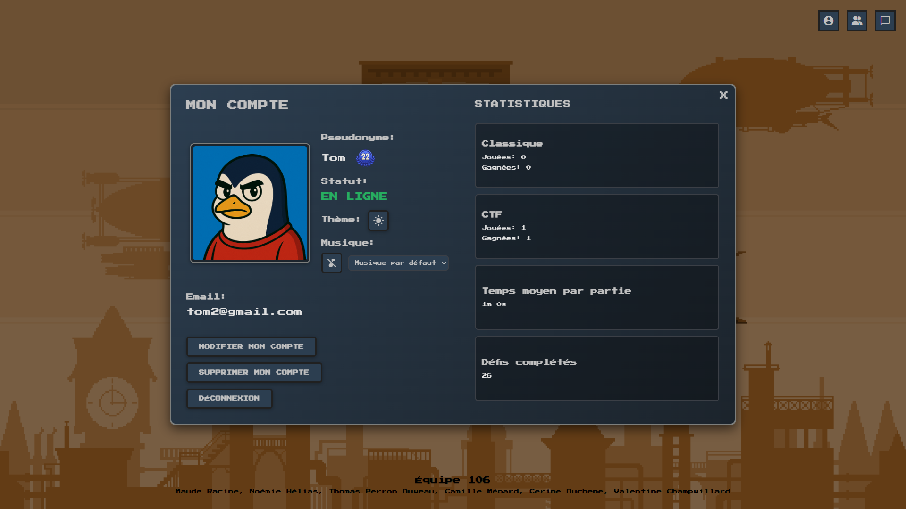
      
Chat Page

  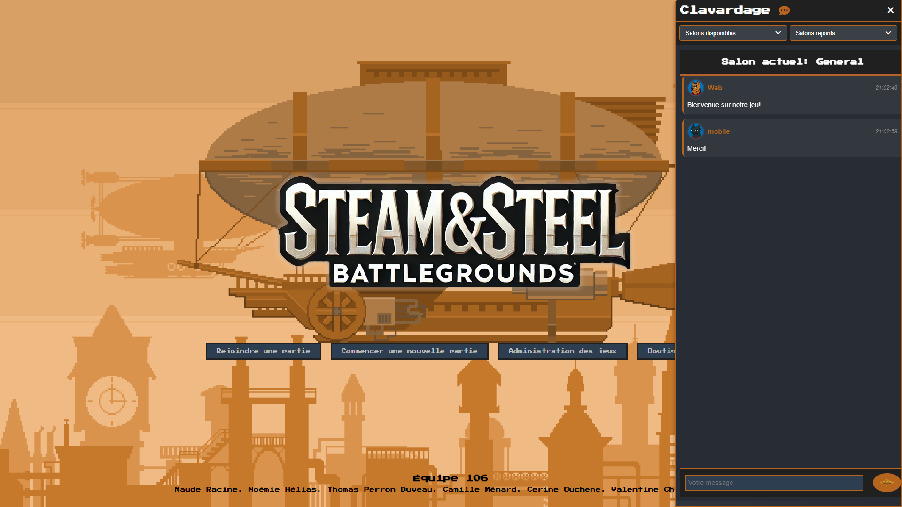
      
Friends Screen

  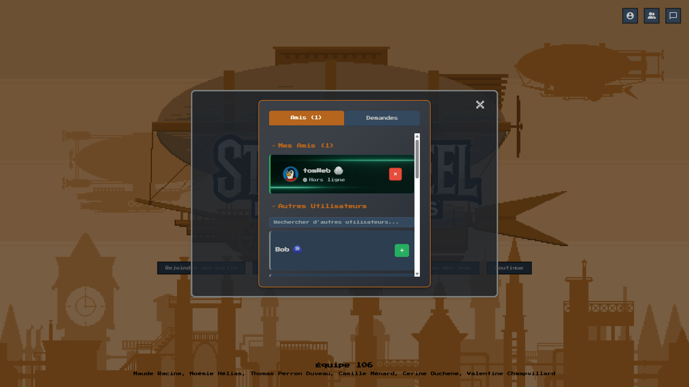
      
Shop

  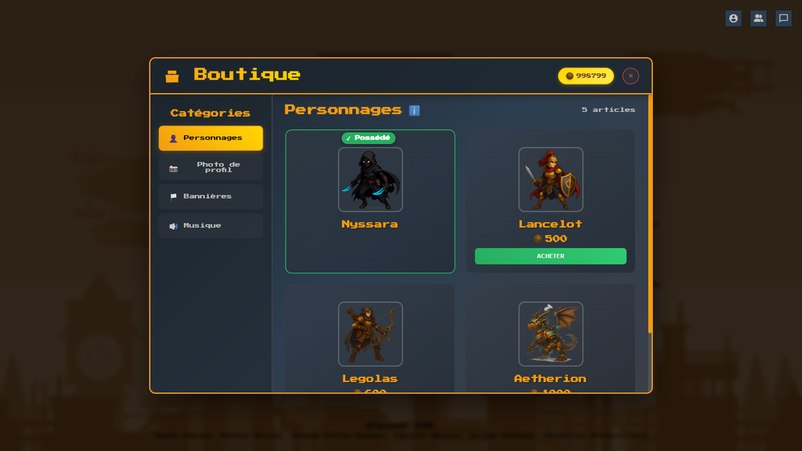
  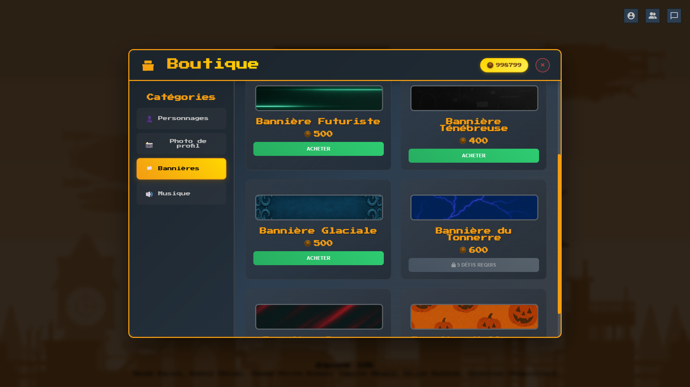
      
Create Map

  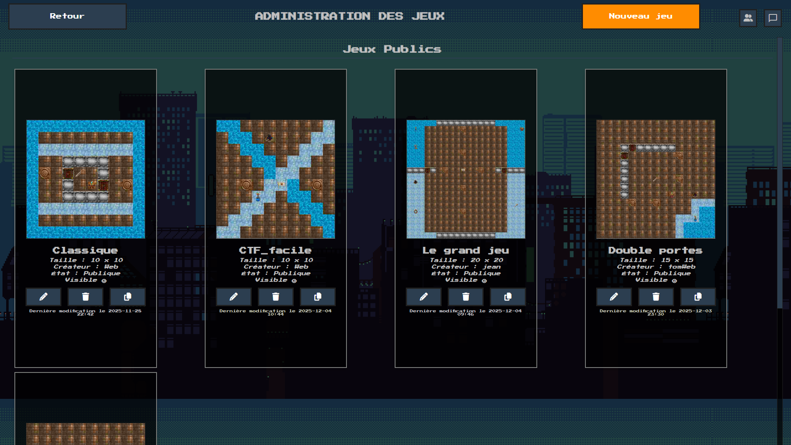
        
Join Game

  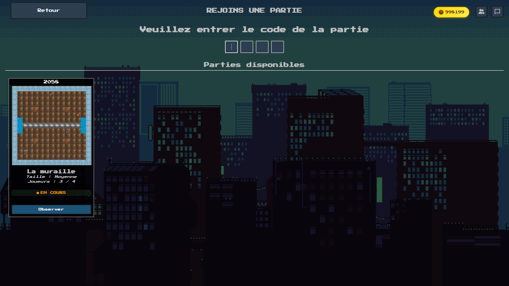
        
Create Game

  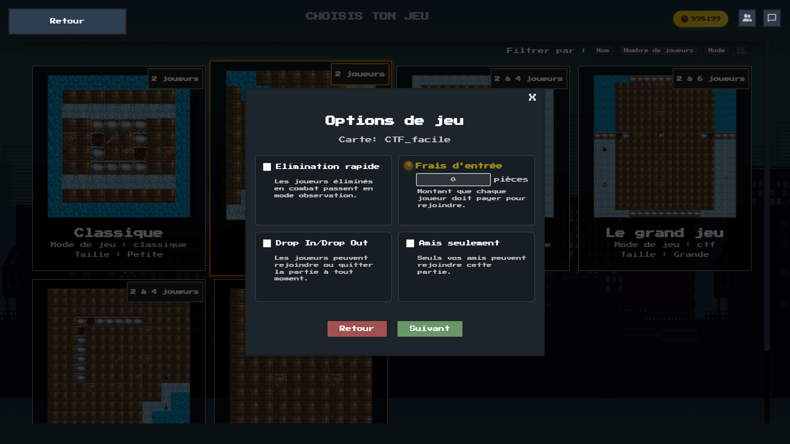
        
Character Creation

  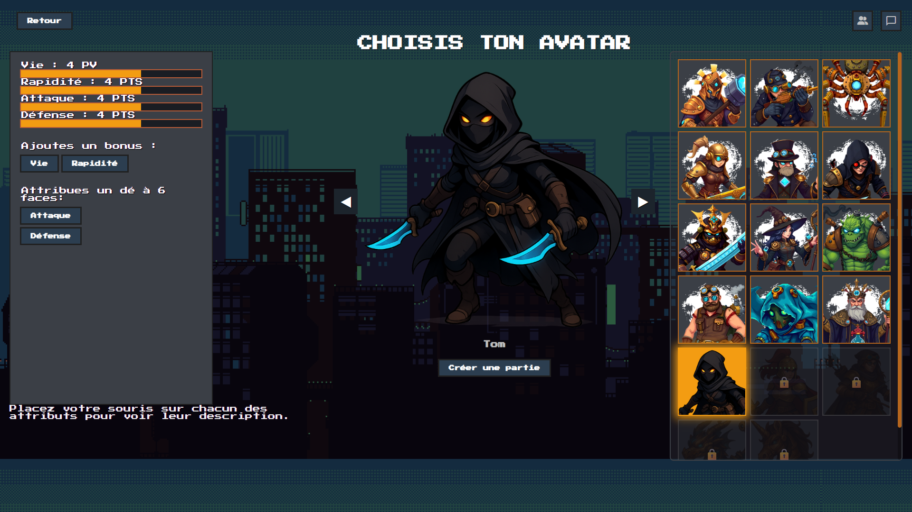
        
Waiting Room

  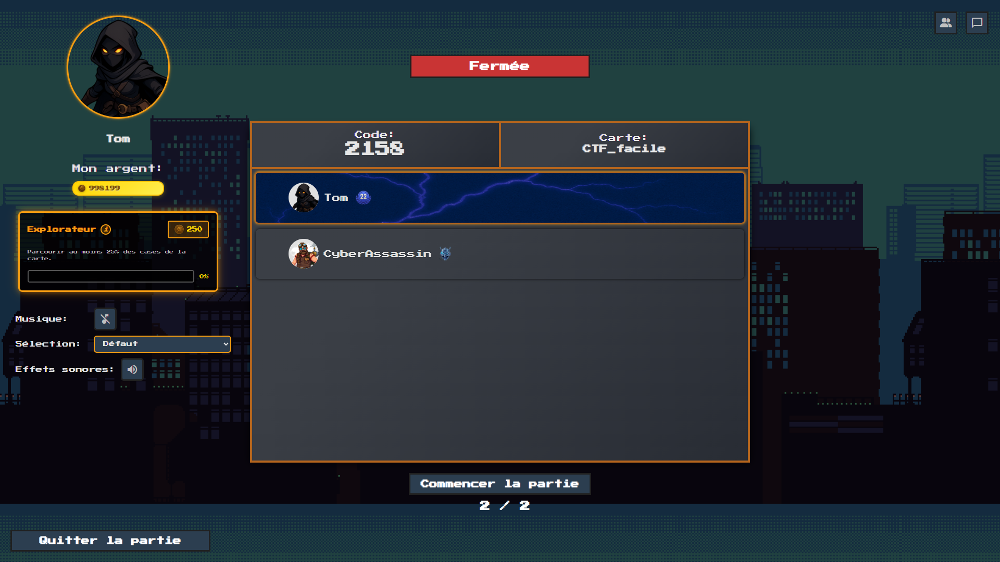
        
Game Screen

  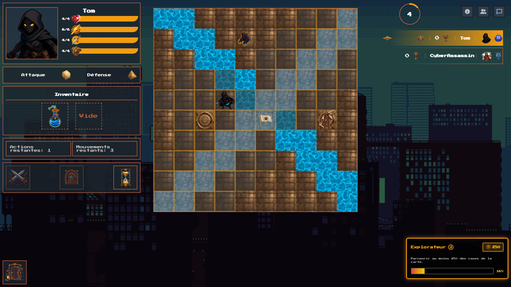
        
Combat Screen

  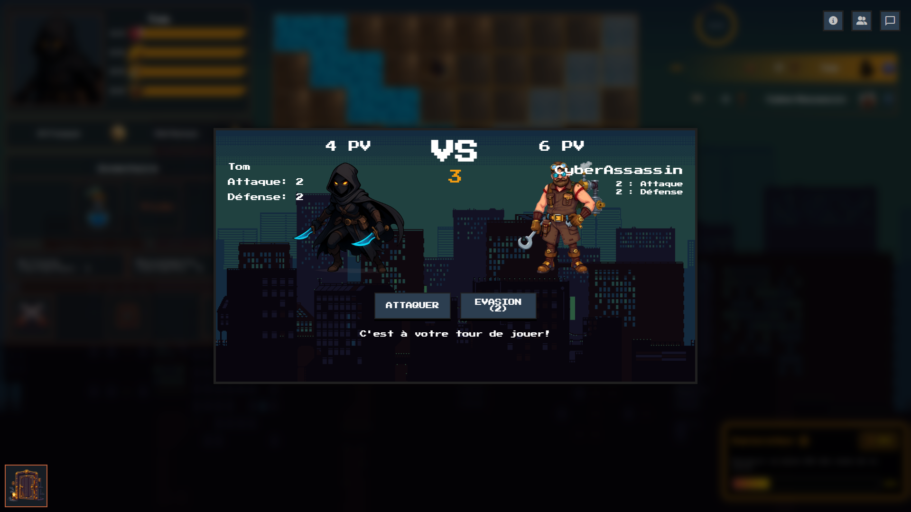
        
Endgame Screen

  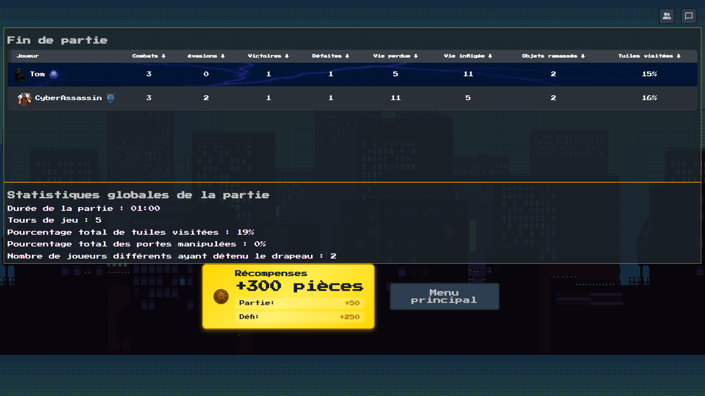

### 👾 Tech Stack

  
Desktop Client

  <ul>
    <li><a href="https://www.typescriptlang.org/">Typescript</a></li>
    <li><a href="https://nextjs.org/">Next.js</a></li>
    <li><a href="https://angular.dev/">Angular</a></li>
  </ul>

  
Mobile Client

  <ul>
    <li><a href="https://dart.dev/">Dart (Flutter)</a></li>
  </ul>

  
Server

  <ul>
    <li><a href="https://www.typescriptlang.org/">Typescript</a></li>
    <li><a href="https://nestjs.com/">Nest.js</a></li>
    <li><a href="https://socket.io/">SocketIO</a></li>
  </ul>

Database

  <ul>
   <li><a href="https://www.mongodb.com/">MongoDB</a></li>
  </ul>

